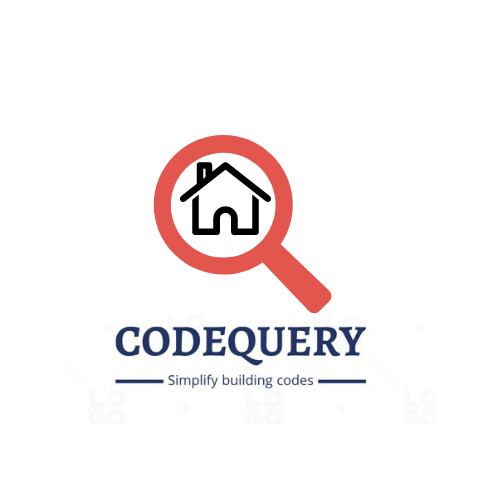

# CodeQuery.AI


For CalHacks Hackathon 2023, team members: Mike Khor, Autumn Rains, Eric Danforth, Meera Vinod

# Background
## Inspiration

Our team was inspired to tackle the complexity of understanding building codes after the tragic death of a dear friend (Alec Lisko) from carbon monoxide poisoning in his apartment in February 2021 in Little Rock, Arkansas. Carbon monoxide detectors are not required by law in rentals in Arkansas. Arkansas is the last remaining state in the country to have outdated safety laws like these. After partnering with local advocacy groups, our research led us to discover that there are no national building codes requiring detectors; each state has unique building codes, and they can also vary at county and city levels. Understanding business codes requires significant domain knowledge in the general construction process, building materials, and legal frameworks. It is not an easy task!

## What it does

**CodeQuery** allows users to search California building codes with ease using ChatGPT-4. In addition to providing summaries of complex codes, **CodeQuery** responses include relevant sections of the code for the user to reference. At the core, our product raises awareness of safety issues in our community while also reducing barriers to access and understanding complex legal standards that govern our community spaces.  Users are able to research and understand building codes as needed. Users served by our product include: 
1. Renters 
2. Homeowners
3. Inspectors & Government Officials
4. Architects
5. Construction companies
6. Real-estate investors or Agents

For example, homeowners interested in renovations may need to know about the permitting and inspection process. Renters may want to inquire about the safety of appliances in their apartment. Real estate investors may want to inquire about states with similar codes for future investment projects. The use cases are many -- **CodeQuery** is the ultimate AI assistance to simplify building codes.

## How we built it

We built **CodeQuery** using Python scripts to parse a 4000+ page PDF document. Embeddings were created using **HuggingFace** (Roberta) which were given to Pinecone for vectorization and memory storage. ChatGPT-4 interacts with **Pinceone** based on user prompts to yield accurate summaries, relevant additional information and specific sections of interest. Our front-end is hosted locally using **Django**.

## Challenges we ran into

- Determining the best vector embeddings for ingestion into ….(API)?
- Parsing a huge PDF of building codes into separate sections/components was particularly difficult

## Accomplishments that we're proud of

- This project came together at the **Calhacks* hackathon. No coding was previously created before our team formed. This is all from scratch! Our dataset was also finalized at the start of the hackathon.
- Our team aligned on a goal of tackling a wicked problem with several challenges.
- Our team successfully parsed a 4000+ page PDF with 9 hierarchical layers (article numbers, chapters, titles, subsections for days..)
- Raising awareness of safety issues in our community - it's a core driver to our mission.
- We have a possible product after 36 hours that can serve our community and improve safety for all.

## What we learned

- How to parse a hierarchical document containing sections, subsections, and fields into Python for digestion.
- How to ‘add relevant information’ into ChatGPT-4.
- How to integrate OpenAI’s API with local host for demo purposes.
- How NOT to code an HTML site with python applications.
- How to build a simple web UI chatbot using GPT-4 (made a Django app for the first time). More broadly, how to use GPT-technologies to develop faster.

## What's next for CodeQuery (CQ)

- We intend to continue iterating and improving access and understanding of state building codes and laws.
- We have several product features to develop as well as additional use cases to research and deploy our product as a solution.

# Development

Set up your API access tokens in source, for example:

```
export OPENAI_API_KEY='sk-xxxxxxxxxxxx'
export OPENAI_ORGANIZATION='org-xxxxxxxxxxxxxx'
export PINECONE_API_KEY='xxxxx-xxxxxxx-xxxxxx'
```

install poetry

```
pip install poetry
```

install dependencies

```
poetry install
```

run main app script

```
cd chatbot_proj
poetry run python manage.py runserver
```
